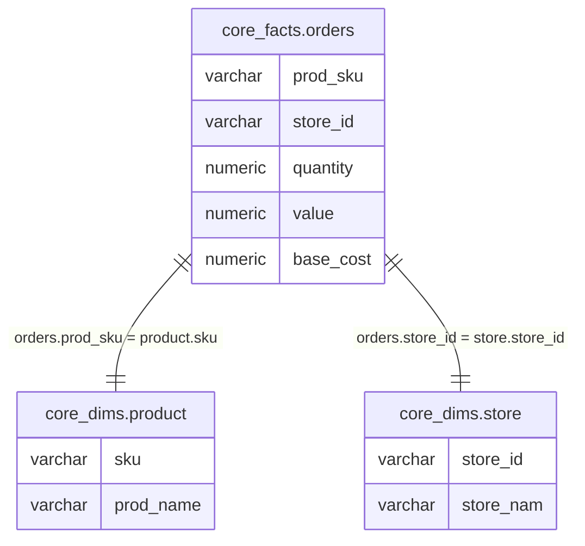

# SQL Analyser

[](https://github.com/austinpoulton/sql-analyser/actions/workflows/ci.yml)
[](https://github.com/austinpoulton/sql-analyser/actions/workflows/security.yml)
[](https://www.python.org/downloads/)
[](https://opensource.org/licenses/MIT)

> **Status: Early Development** — domain model and core analysis features are being implemented. The API below shows the target interface.

SQL Analyser parses a SQL statement via [sqlglot](https://github.com/tobymao/sqlglot) and reverse-engineers a structured specification of the query: **source tables and columns**, **relationships**, **output column lineage**, **complexity metrics**, and **measure/dimension classification** — without executing or validating the SQL.

## Key Features

- **Source data model** — base tables and columns resolved from all clauses (`SELECT`, `JOIN`, `WHERE`, `HAVING`, `ORDER BY`, `GROUP BY`); CTEs and subqueries flattened to base tables.
- **Relationships** — extracted from explicit `JOIN` conditions and implicit joins in `WHERE` clauses.
- **Column lineage** — maps each output alias back to its source `table.column` with transformations.
- **Measure / dimension classification** — columns inside aggregates → measure; `GROUP BY` columns → dimension.
- **Complexity metrics** — AST node count, scope count, scope types.
- **Rendering** — Mermaid ERD and DBML output via Jinja2 templates.
- **Model merging** — union multiple `DataModel` instances with type-specificity resolution.

## Example

Given this SQL with a CTE, aggregations, and joins:

```sql
WITH cte_ordered_products_store AS (
    SELECT prod_sku, store_id,
           SUM(quantity) AS quantity, SUM(value) AS revenue,
           AVG((value - base_cost) / base_cost) AS avg_margin
    FROM core_facts.orders
    GROUP BY prod_sku, store_id
)
SELECT p.prod_name AS product_name, s.store_nam AS store_name,
       o.revenue, o.quantity, o.avg_margin
FROM core_dims.product p
LEFT JOIN cte_ordered_products_store o ON o.prod_sku = p.sku
LEFT JOIN core_dims.store s ON s.store_id = o.store_id
```

The SQL Analyser resolves through the CTE to extract the base tables and produces:



## Requirements

- Python ≥ 3.12
- [uv](https://github.com/astral-sh/uv) for dependency management

## Quickstart

```bash
# install dependencies
uv sync

# run tests
uv run pytest
```

## Target API

> This is the planned interface. It may change as features are implemented.

```python
import sqlglot
from sql_analyser import analyse

ast = sqlglot.parse_one(sql, dialect="ansi")
model = analyse(ast)

# Render as Mermaid ERD
print(model.to_mermaid())

# Serialise to JSON
print(model.model_dump_json(indent=2))

# Merge models from multiple queries
combined = model1.merge(model2)
```

## Domain Model

| Class | Purpose |
|---|---|
| `DataModel` | Container for `QueriedTable`s and `Relationship`s. Supports merging. |
| `QueriedTable` | A base table and its observed `QueriedColumn`s. |
| `QueriedColumn` | Column name, inferred data type (default `varchar`), usage context. |
| `Relationship` | Association between two tables on specific columns. |

All classes are Pydantic models, serialisable to/from JSON.

## Using as a Dependency

```bash
# from another project using uv
uv add ../sql-analyser

# or with pip (editable install)
pip install -e /path/to/sql-analyser
```

## Specification

See [SQL-ANALYSER-SPEC.md](SQL-ANALYSER-SPEC.md) for the full functional and technical specification.

## Contributing

We welcome contributions! Please see:
- [CONTRIBUTING.md](CONTRIBUTING.md) - Development setup, testing, and PR process
- [SECURITY.md](SECURITY.md) - Security policy and vulnerability reporting
- [RELEASING.md](RELEASING.md) - Release process documentation

## CI/CD and Security

SQL Analyser uses automated CI/CD with comprehensive security scanning:
- **Continuous Integration**: Linting, type checking, and tests on Python 3.12/3.13 across Ubuntu/macOS/Windows
- **Security Scanning**: Weekly dependency vulnerability scans (pip-audit), SAST (Bandit), and license compliance checks
- **Automated Releases**: PyPI publishing via trusted publisher with TestPyPI validation
- **Dependabot**: Automated dependency update PRs

See the [Security tab](../../security) for scan results.

## Author & Affiliation
sql-analyser was created by Austin Poulton at [Equal Experts](https://www.equalexperts.com/)

Equal Experts is a global network of experienced technology consultants who are passionate about making software better.

## Citation

If you use this software in your research or project, please cite it using the metadata in [CITATION.cff](CITATION.cff).

## Licence

This project is licensed under the MIT License - see the [LICENSE](LICENSE) file for details.