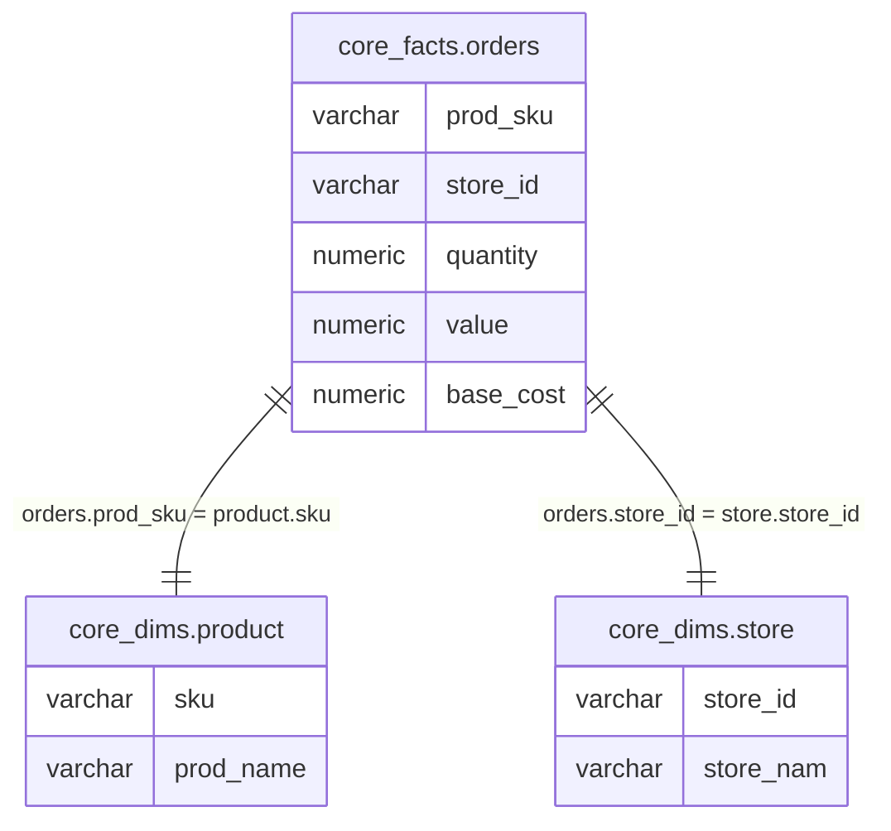

# SQL Analyser Specification

## 1. Problem Statement

Migration of complex SQL queries and transformations requires time-consuming analysis to understand:

- the source data models that power the queries
- the transformation logic
- and the resulting output

Using generative AI does accelerate the analysis and reverse engineering process but still requires human-in-the-loop review of its output. For large-scale data migration problems (many thousands of queries or transformations to be migrated/remapped) there is a common core set of source data models and transformations that drive 80% of flows/reports, assuming the Pareto principle. The key is to identify the common source data models without necessarily relying on AI interpretation.

## 2. Overview

The purpose of the SQL Analyser is to extract key metadata and metrics from a single SQL query or statement. The SQL Analyser deterministically reverse-engineers a data model of source tables and their columns from a parsed SQL AST. Analysing SQL statements/queries and extracting the source data model, output dataset and the transformation logic into structured specifications will enable human analysts/engineers and AI agents to more easily understand the source data, intent and transformation logic and therefore result in better quality and more efficient migrations.

A summary of SQL Analyser key features:

* **A source data model**
  * **Source tables** resolved to base tables (CTEs and subqueries are flattened) and their constituent columns from all clauses (`SELECT`, `WHERE`, `HAVING`, `ORDER BY`, `GROUP BY`, `JOIN`)
  * **Relationships** as identified from explicit `JOIN` conditions and implicit joins in `WHERE` clauses
* **Complexity metrics**
  * Number of abstract syntax tree nodes
  * Number of scopes (CTEs, subqueries, unions)
* **Resulting output dataset**
  * Column lineage: mapping from source columns to output aliases
  * Using cues from aggregate functions and groupings infer:
    * Measures (columns inside aggregate functions: `SUM`, `AVG`, `COUNT`, etc.)
    * Dimensions (columns in `GROUP BY` clauses)
  * Business rules, transformations

## 3. Non-Goals

The following are explicitly out of scope:

* **SQL execution or validation** — the analyser does not execute queries or validate them against a live database
* **Query optimisation** — no rewriting or performance analysis
* **Full catalog integration** — data types are inferred best-effort from SQL context; external catalog support may be added later
* **Multi-statement scripts** — the analyser processes a single SQL statement; orchestrating multiple statements is a downstream concern
* **Dialect-specific parsing** — dialect handling is delegated to sqlglot; the analyser operates on ANSI SQL semantics

## 4. User Personas

| Persona | Description | Goal |
| --- | --- | --- |
| Business/Data Analyst | Ensures business needs are met by data models and reporting queries. Comfortable with logic expressions and data. | Validate queries and their data model requirements with business users. Validate reporting specifications with users. |
| Data/Platform Engineer | Builds target migration pipelines and data models. Needs to understand source schema dependencies and transformation logic. | Map legacy SQL artefacts to target platform constructs efficiently and accurately. |
| AI Agent | An AI assistant that works with analysts and engineers to understand legacy SQL queries. | Consume structured specifications of legacy queries to assist with analysis and migration. |

## 5. Glossary

| Term | Definition |
| --- | --- |
| **Source data model** | The set of base tables, their columns, and relationships extracted from a SQL query — representing the upstream data the query depends on. |
| **Scope** | A distinct SQL context that encapsulates its own table and column references. Scopes include CTEs, subqueries, unions, and the root query. Represented by sqlglot's `Scope` class. |
| **Base table** | A physical or logical table referenced in the SQL (not a CTE or subquery alias). The analyser resolves through CTEs/subqueries to identify these. |
| **QueriedTable** | Domain model class representing a base table as observed in the analysed SQL, containing the set of columns referenced. |
| **QueriedColumn** | Domain model class representing a single column of a QueriedTable, with inferred data type and usage role. |
| **Relationship** | An association between two QueriedTables on specific columns, inferred from explicit `JOIN` conditions or implicit joins in `WHERE` clauses. |
| **Measure** | An output column derived from an aggregate function (`SUM`, `AVG`, `COUNT`, `MIN`, `MAX`, etc.). |
| **Dimension** | An output column that appears in a `GROUP BY` clause. |
| **Column lineage** | The mapping from a source column (table.column) to its output alias in the query's `SELECT` list, including any transformations applied. |

## 6. Functional Requirements Summary

| ID | Requirement | Priority | Acceptance Criteria |
| --- | --- | --- | --- |
| FR-001 | Extract all source base tables and their columns referenced in a SQL query across all clauses (`SELECT`, `JOIN`, `WHERE`, `HAVING`, `ORDER BY`, `GROUP BY`). CTEs and subqueries are resolved to their underlying base tables. | Must | For a set of test SQL queries, the correct source tables and their columns are extracted, including columns only referenced in `WHERE`/`HAVING`/`ORDER BY`. |
| FR-002 | Extract all relationships between source tables from explicit `JOIN` conditions and implicit joins in `WHERE` clauses. Cardinality defaults to unspecified. | Must | For a set of test SQL queries, all relationships (explicit and implicit) are correctly extracted with the correct join columns. |
| FR-003 | Generate a source data model comprising source tables, their columns, and relationships. The data model is serialisable to/from JSON and can be rendered as Mermaid ERD and DBML via Jinja2 templates. | Must | For a set of test queries, the source data model is extracted and successfully renders to valid Mermaid ERD and DBML output. |
| FR-004 | Compute complexity metrics: number of AST nodes, number of scopes, and scope types. | Must | For a set of test SQL queries, complexity metrics are correctly computed. |
| FR-005 | Infer data types best-effort from SQL context. Default type is `varchar`. Columns inside aggregate functions are typed as numeric where inferable. Explicit `CAST` expressions are honoured. | Should | For a set of test SQL queries, inferred types match expected values; `varchar` is used as fallback. |
| FR-006 | Classify output columns as measure, dimension, or attribute. Columns inside aggregate functions = measure; columns in `GROUP BY` = dimension; all others = attribute. | Should | For a set of test queries, output columns are correctly classified. |
| FR-007 | Track column lineage: map each output column alias to its source table.column and any transformations applied. | Should | For a set of test queries, the lineage from source column to output alias is correctly captured. |
| FR-008 | Handle `SELECT *` and wildcard expressions. When encountered, the analyser should flag the wildcard (columns cannot be resolved without a catalog) and record it as a marker on the relevant QueriedTable. | Should | Queries containing `SELECT *` produce a model with the wildcard flagged; no false columns are invented. |
| FR-009 | Merge DataModels from multiple queries. Union of tables at the DataModel level and union of columns at the QueriedTable level, with type specificity resolution (more specific type wins over `varchar`). | Must | Two DataModels with overlapping tables merge correctly; specific types are preserved over `varchar` defaults. |

## 7. Technical Requirements

### 7.1 Sqlglot for Parsing SQL

The SQL Analyser relies on [sqlglot](https://github.com/tobymao/sqlglot), a SQL parser and transpiler library, to parse SQL queries into an abstract syntax tree (AST). The SQL Analyser expects as input an instance of a [sqlglot.Expression](https://sqlglot.com/sqlglot/expressions.html#Expression). Dialect-specific parsing is handled upstream by the caller using sqlglot's `parse_one(sql, dialect=...)`.

SQL queries and statements can have multiple semantic *scopes*. A scope encapsulates table and column references within a CTE, subquery, union or other SQL construct. Sqlglot provides a [Scope](https://sqlglot.com/sqlglot/optimizer/scope.html) class that represents the metadata for a scope. Sqlglot provides the `traverse_scope` function that returns all the semantic scopes in the SQL statement given an AST.

### 7.2 Domain Model

A domain model for representing and working with data model elements extracted from SQL queries. Classes:

* **DataModel** — container for QueriedTables and Relationships. Supports merging with other DataModel instances.
* **QueriedTable** — container for all QueriedColumns observed for a base table. Identified by fully-qualified table name (e.g., `schema.table`). Supports merging with other QueriedTable instances.
* **QueriedColumn** — represents a column with: name, inferred data type (default `varchar`), and usage context (where the column was referenced).
* **Relationship** — an association between two QueriedTables on specific QueriedColumns, inferred from join conditions. Cardinality is unspecified by default.

**Requirements:**

* **Serialisable:** All domain model classes must be serialisable to/from JSON.
* **Accessible properties:** The data model must expose properties suitable for rendering via Jinja2 templates (Mermaid ERD, DBML).
* **Merging (DataModel and QueriedTable):** Set union of columns at the QueriedTable level; set union of tables at the DataModel level.
  * **Merge rules:**
    * Two QueriedTables are mergeable when their fully-qualified identifiers are equal.
    * Columns are matched by name. When two columns share the same name, the more specific data type wins (any non-`varchar` type takes precedence over `varchar`). If both have non-`varchar` types that conflict, the merge should raise a warning but prefer the left-hand operand.
    * Relationships are unioned; duplicates (same tables, same columns) are deduplicated.

### 7.3 Rendering with Jinja2

Use Jinja2 templates for rendering Mermaid ERD and DBML from domain model objects.

### 7.4 Error Handling

* **Syntactically valid but semantically unusual SQL** (e.g., self-joins, correlated subqueries): the analyser should process these on a best-effort basis and not raise errors. Edge cases that cannot be fully resolved should produce partial results with warnings.
* **`SELECT *` / wildcards**: flagged on the QueriedTable as an unresolved wildcard rather than inventing columns.

### 7.5 Development and Testing

* Use `uv` for Python package dependency management.
* Use `pytest` for testing. Each functional requirement should have unit tests covering code paths and input variability.
* Use `pydantic` for domain model classes (provides serialisation, validation, and clean property access).

## 8. Test Cases

### 8.1 CTE with Aggregations and Joins

**Input SQL:**

```sql
WITH cte_ordered_products_store AS (
    SELECT
        prod_sku,
        store_id,
        SUM(quantity) AS quantity,
        SUM(value) AS revenue,
        AVG((value - base_cost) / base_cost) AS avg_margin
    FROM core_facts.orders
    GROUP BY prod_sku, store_id
)
SELECT
    p.prod_name AS product_name,
    s.store_nam AS store_name,
    o.revenue,
    o.quantity,
    o.avg_margin
FROM core_dims.product p
LEFT JOIN cte_ordered_products_store o
    ON o.prod_sku = p.sku
LEFT JOIN core_dims.store s
    ON s.store_id = o.store_id
```

**Expected Mermaid ERD output:**



### 8.2 Additional Test Patterns (Must Handle)

The following SQL patterns must be covered by test cases for each relevant FR:

| Pattern | Key Aspect to Verify |
| --- | --- |
| Simple `SELECT` with `WHERE` filter | Columns in `WHERE` appear in source model |
| Implicit join (`FROM a, b WHERE a.id = b.id`) | Relationship extracted from `WHERE` clause |
| `UNION` / `UNION ALL` | Multiple scopes resolved; base tables from all branches |
| Correlated subquery | Base tables resolved through subquery scope |
| `EXISTS` subquery | Columns/tables in `EXISTS` clause included |
| Window functions (`OVER`, `PARTITION BY`) | Columns in window specs included in source model |
| Self-join | Same table appears once in model; relationship references same table on both sides |
| `SELECT *` | Wildcard flagged; no false columns generated |
| Nested CTEs (CTE referencing another CTE) | All resolved to base tables |
| Multiple aggregations with `HAVING` | `HAVING` columns included; measures correctly classified |
| `ORDER BY` column not in `SELECT` | Column included in source model |
| Explicit `CAST` expressions | Inferred type reflects the cast target |
